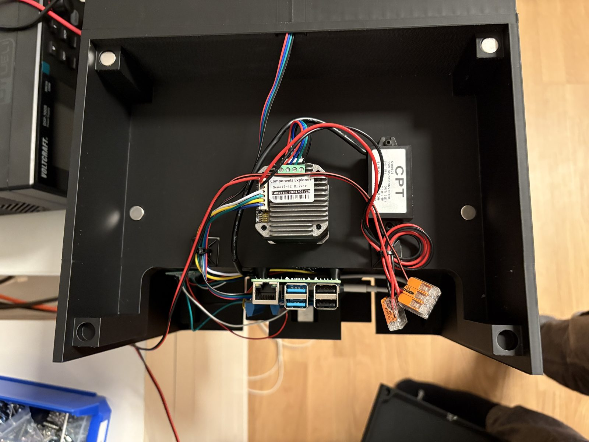
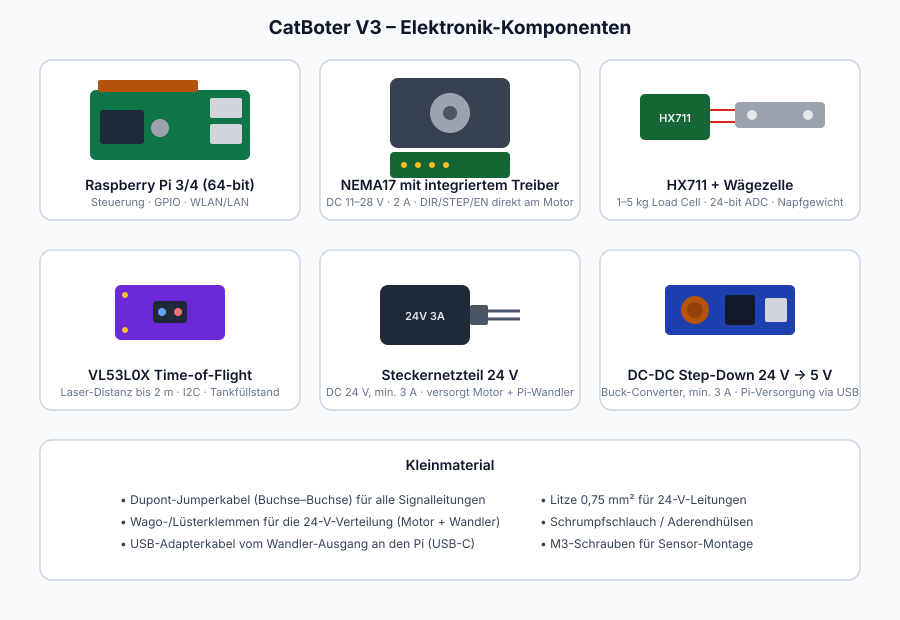

# CatBoter V3

> Intelligenter Katzenfutterautomat auf Raspberry-Pi-Basis — grammgenaue Fütterung, Mobile-First-App, Notfall-Hotspot.


## Funktionen

- **Grammgenaue Fütterung** — geschlossener Regelkreis über Wägezelle: der Motor fördert, bis das Zielgewicht im Napf liegt (mit Stillstands-Erkennung, Not-Aus-Timer und Überfütterungsschutz)
- **Fütterungspläne** — feste Zeiten (Auto-Plan) oder Zufallszeiten im Zeitfenster (Random-Plan) mit Mindestabstand
- **Manuelle Fütterung** — Schnellwahl (10/20/30/50 g) oder freie Menge, mit Live-Fortschritt in der App
- **Live-Dashboard** — Tankfüllstand (%), Napfgewicht, Tagesverbrauch in Echtzeit (Socket.IO)
- **Statistik** — Tagesverlauf, Durchschnitt, Zuverlässigkeit, Systemwerte
- **Messbasierte Tank-Kalibrierung** — „Aktuell = voll / leer" per Knopfdruck, ideal für höhenverstellbare Tanks
- **Smart-Feed** — liegt noch Futter im Napf, dosiert der Plan nur die Differenz (mehrfach gemessene, plausibilisierte Waagen-Entscheidung)
- **Anti-Schling-Modus** — Portion in kleinen Schüben über wählbare Minuten (pro Plan und manuell)
- **Urlaubsmodus** — Fütterungen bis Zeitpunkt X pausieren; Verlauf mit **CSV-Export** fürs Tierarztgespräch
- **Futter-Reichweite** — „Tank reicht noch ~4 Tage", selbstlernend aus Verbrauch und Füllstand
- **Backup in der App** — genau ein Backup auf dem Gerät (überschreibend), Download & Wiederherstellung direkt im Browser
- **Push-Benachrichtigungen** — Fütterung fehlgeschlagen, Tank niedrig, Napf lange unberührt (Web Push, ohne Cloud-Dienst)
- **Gesundheits-Monitor** — Fressgeschwindigkeit und „Napf seit X h unberührt"-Warnung aus der Gewichtskurve
- **MQTT / Home Assistant** — `catboter/status` (lesen, retained) + `catboter/command` (steuern: feed/stop/pause/resume), optional HA-Discovery
- **Kalorienrechner** — Katzenprofil → empfohlene Tagesmenge (RER/MER), direkt in den Plan übernehmbar
- **Notfall-Hotspot** — verliert der CatBoter jede Netzwerkverbindung (WLAN *und* LAN), startet er automatisch den Hotspot `CatBoter-Setup`; über `http://10.0.0.1` ist die volle App erreichbar
- **PWA** — als App auf dem Homescreen installierbar, Hell-/Dunkel-Design automatisch

## Screenshots

| Übersicht | Fütterungspläne | Statistik | System |
|:---:|:---:|:---:|:---:|
|  |  |  |  |

## Hardware

> 🔧 **[Ausführliche Aufbau-Anleitung mit Fotos und Schema → docs/AUFBAU.md](docs/AUFBAU.md)**





### Komponentenliste mit Bezugsquellen

| Komponente | Spezifikation | Zweck | Bezugsquelle |
|---|---|---|---|
| Raspberry Pi 3/4 | 64-bit, WLAN | Steuerung | [raspberrypi.com](https://www.raspberrypi.com/products/) |
| NEMA17 mit **integriertem Treiber** | „One-Machine-Driver", DC 11–28 V, 2 A, empfohlen 24 V | Futterförderung (Schnecke) | [AliExpress](https://www.aliexpress.us/item/3256808913561157.html) · [Grandado](https://gbr.grandado.com/products/nema-17-integrated-motor-driver-42-stepper-motor-one-machine-driver-dc11v-dc28v-2a-recommending-dc24v-2) |
| HX711-Modul | 24-bit-ADC für Wägezellen | Napfgewicht (Regelkreis + Verbrauch) | Datenblatt: [Avia HX711 (PDF)](https://cdn.sparkfun.com/datasheets/Sensors/ForceFlex/hx711_english.pdf) |
| Wägezelle (Load Cell) | 1–5 kg, Halbleiter-DMS | unter dem Napf | übliche Elektronik-Händler (mit HX711 oft im Set) |
| VL53L0X | Time-of-Flight-Laser, bis 2 m, I2C | Tankfüllstand | [ST-Produktseite](https://www.st.com/en/imaging-and-photonics-solutions/vl53l0x.html) |
| Steckernetzteil 24 V | DC 24 V, **min. 3 A** (Motor 2 A + Pi) | Hauptversorgung | Elektronik-Händler |
| DC-DC Step-Down 24 V → 5 V | Buck-Converter, min. 3 A, USB-Ausgang | Pi-Versorgung aus dem 24-V-Netzteil | [AliExpress (verwendetes Modul)](https://www.aliexpress.us/item/2255801001346505.html) |

### Verdrahtung (Signale + Stromversorgung)


**Signale (BCM-Nummerierung):**

| Signal | BCM-Pin | Modul |
|---|---|---|
| DIR | GPIO 26 | integrierter Motor-Treiber |
| STEP / PUL | GPIO 21 | integrierter Motor-Treiber |
| ENABLE | GPIO 4 | integrierter Motor-Treiber (LOW = aktiv) |
| DT | GPIO 17 | HX711 |
| SCK | GPIO 18 | HX711 |
| SDA / SCL | GPIO 2 / 3 | VL53L0X (I2C) |

**Stromversorgung:**

1. Steckdose (230 V AC) → **geschlossenes 24-V-Steckernetzteil** (keine offene Netzverdrahtung nötig)
2. 24 V über Wago-/Lüsterklemme verteilt auf:
   - **Motor V+ / V−** (integrierter Treiber, dicke Leitungen, 0,75 mm²)
   - **Buck-Converter** → 5 V → per USB an den Raspberry Pi
3. **Gemeinsame Masse:** Netzteil-Minus, Treiber-Logik-GND, Pi-GND und alle Sensor-GND verbinden

⚠️ **Sicherheit:** Pi niemals direkt an 24 V. Beim Anschliessen erst GND, dann V+. Motor-Leitungen getrennt von Signal-Leitungen führen (Störungen). I2C per `sudo raspi-config` aktivieren.

## Installation

**Voraussetzung:** Raspberry Pi OS (64-bit, Lite empfohlen) mit **SSH** und **I2C** aktiviert —
Schritt-für-Schritt in der [Aufbau-Anleitung, Schritt 0](docs/AUFBAU.md#schritt-0--raspberry-pi-vorbereiten).
Kurzform: SSH + WLAN direkt im Raspberry Pi Imager setzen, danach `sudo raspi-config nonint do_i2c 0`.

```bash
# 1. Repository klonen
git clone https://github.com/uiff/catBoter_V2.git catBoterV3
cd catBoterV3

# 2. Docker installieren (falls noch nicht vorhanden)
curl -fsSL https://get.docker.com | sh
sudo usermod -aG docker $USER

# 3. Frontend bauen (Node 20+ nötig; alternativ auf dem PC bauen und dist/ kopieren)
cd frontend-new && npm install && npm run build && cd ..

# 4. WiFi-Fallback-Host-Service installieren (Hotspot-Notfallmodus)
sudo apt install -y hostapd dnsmasq
sudo systemctl disable --now hostapd dnsmasq
sudo cp backend/system/catboter-wifi-fallback.service /etc/systemd/system/
sudo systemctl daemon-reload
sudo systemctl enable --now catboter-wifi-fallback

# 5. Container starten
docker compose up -d --build
```

Die App ist danach unter `http://<pi-ip>/` erreichbar.

## Erste Einrichtung

1. **Waage kalibrieren:** System → Waage → „Kalibrieren" — Napf leeren, tarieren, Referenzgewicht (z. B. 100 g) auflegen, Wert eintragen.
2. **Tank kalibrieren:** System → Tank — bei vollem Tank „Aktuell = voll übernehmen", bei leerem Tank „Aktuell = leer übernehmen", speichern.
3. **Plan anlegen:** Fütterung → Neu — feste Zeiten oder Zufallsmodus wählen, Tagesmenge festlegen, aktivieren.

## Notfall-Hotspot

Verliert der CatBoter für ~90 Sekunden jede Netzwerkverbindung, startet er automatisch einen eigenen Hotspot:

1. Mit dem WLAN **`CatBoter-Setup`** verbinden (Standard-Passwort in System → Notfall-Hotspot konfigurierbar)
2. `http://10.0.0.1` öffnen → volle App
3. Unter System → Netzwerk das richtige WLAN suchen und verbinden — der Hotspot schaltet sich danach selbst ab

Steckt ein LAN-Kabel mit funktionierender Verbindung, bleibt der Hotspot aus (das Gerät ist ja erreichbar).

## Architektur

```
┌─────────────┐  Socket.IO + REST  ┌──────────────────────────────┐
│  React-PWA  │◄──────────────────►│  Flask-Backend (Container)   │
│  (nginx)    │                    │  api/ · services/ · core/    │
└─────────────┘                    │  ├─ feed_until_weight-Regel- │
                                   │  │  kreis (Motor + Waage)    │
┌──────────────────────────┐       │  ├─ Scheduler (60-s-Tick)    │
│ WiFi-Fallback-Service    │◄─────►│  └─ Daten: /app/data (Volume)│
│ (Host, systemd, nmcli)   │ Datei-└──────────────────────────────┘
│ Hotspot bei Netzverlust  │  IPC
└──────────────────────────┘
```

- **Backend:** Flask + eventlet + Flask-SocketIO, modular (Blueprints/Services), läuft privilegiert im Container (GPIO/I2C)
- **Frontend:** React 19, Vite, Tailwind, zustand + react-query, eine Socket-Verbindung, Bottom-Tab-Navigation
- **Persistenz:** alles unter `backend/data/` (Bind-Mount) — Kalibrierungen, Verbrauchshistorie, Konfigurationen überleben jeden Rebuild
- **Sicherheit der Fütterung:** max. 2 Versuche pro geplanter Fütterung mit Restmengen-Logik, richtungsunabhängige Stillstands-Erkennung (Napf entfernt → Abbruch statt Dauerförderung), Motor-Stopp per `try/finally` auf jedem Pfad

## Backup

```bash
./create-backup.sh   # sichert Projekt + alle Laufzeitdaten als tar.gz auf den Desktop
```

---

*Ein Projekt von [iotueli](https://iotueli.ch)*
