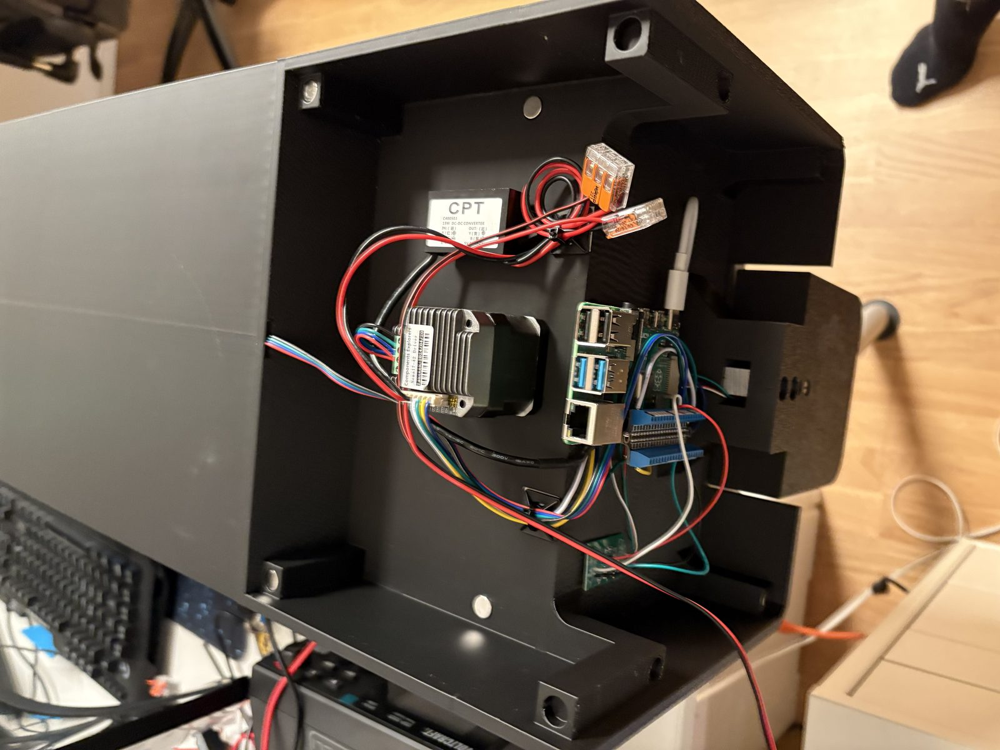
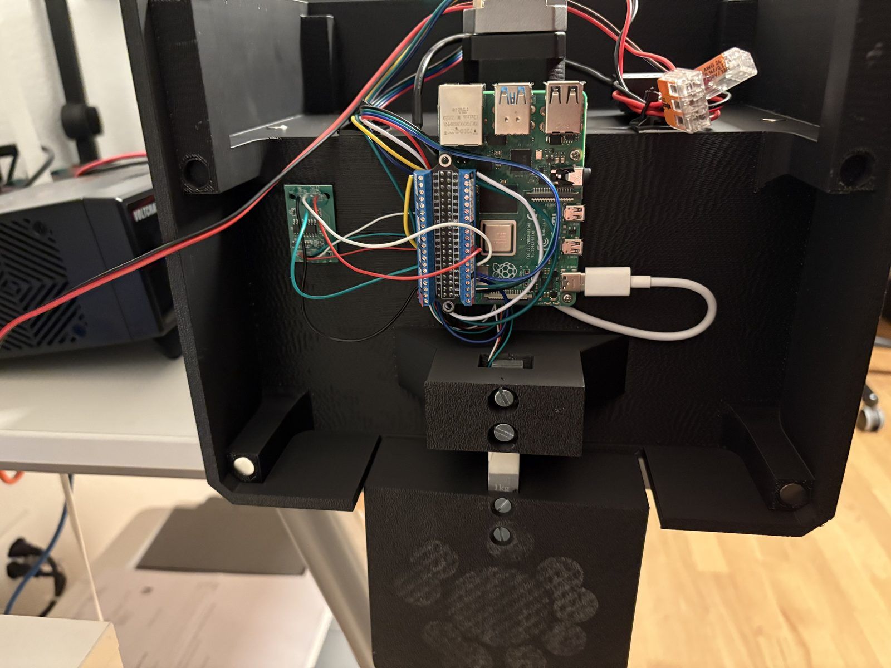
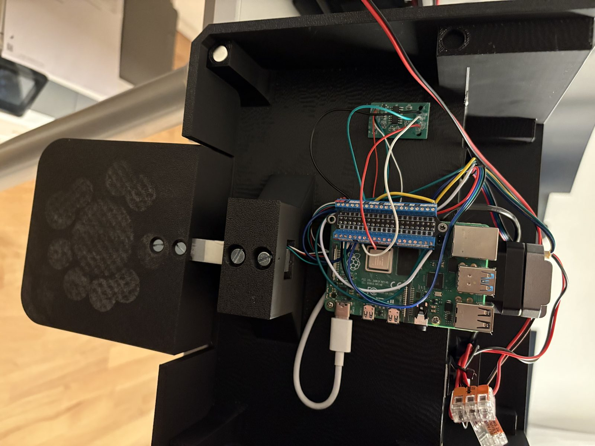

# CatBoter V3 — Aufbau-Anleitung

Schritt-für-Schritt-Anleitung für den Zusammenbau. Komponentenliste mit Bezugsquellen
steht in der [README](../README.md#hardware), der komplette Schaltplan hier:


## Der fertige Aufbau

| Elektronik-Fach | Motor, Treiber & Wandler |
|:---:|:---:|
|  |  |

| Pi mit Klemmen-Aufsatz & Wägezelle | Verkabelung im Detail |
|:---:|:---:|
|  |  |

## Verwendete Bauteile (wie auf den Fotos)

- **Raspberry Pi 4** mit **GPIO-Schraubklemmen-Aufsatz** (blaues Breakout-Board direkt
  auf dem 40-Pin-Header) — alle Signalleitungen werden geschraubt, nichts gelötet
- **NEMA17-42 mit integriertem Treiber** („Components Explorers", Kühlkörper hinten am
  Motor): grüne Schraubklemme = 24-V-Versorgung, JST-Stecker = Signalleitungen
- **CPT C400503** 15-W-DC-DC-Wandler (24 V → 5 V, vergossen), Ausgang per USB-Kabel
  an den USB-C-Port des Pi
- **HX711**-Platine + **1-kg-Wägezelle** (Balken), trägt den Napfarm mit Pfoten-Platte
- **VL53L0X** oben im Futtertank (misst nach unten auf die Futteroberfläche)
- **WAGO-221**-Klemmen für die 24-V-Verteilung
- 3D-gedrucktes Gehäuse mit Magnet-Deckel und eigenem Elektronik-Fach

## Schritt 0 — Raspberry Pi vorbereiten

1. **Raspberry Pi OS (64-bit) flashen** mit dem [Raspberry Pi Imager](https://www.raspberrypi.com/software/) —
   die **Lite**-Version reicht und spart über 3 GB SD-Speicher.
2. **Im Imager (Zahnrad/„Anpassen") direkt einstellen** — das erspart Monitor und Tastatur:
   - **SSH aktivieren** (Fernzugriff — so wird der CatBoter später gewartet und deployt)
   - **WLAN** (SSID + Passwort) und **Hostname** (z. B. `catboter`)
   - Benutzername/Passwort setzen
3. Nach dem ersten Boot per SSH verbinden und **I2C aktivieren** (für den VL53L0X):

   ```bash
   ssh <benutzer>@catboter.local
   sudo raspi-config nonint do_i2c 0     # I2C einschalten
   sudo raspi-config nonint do_ssh 0     # SSH dauerhaft an (falls nicht im Imager gesetzt)
   sudo reboot
   ```

4. Prüfen, ob der Distanzsensor gefunden wird (nach der Verdrahtung in Schritt 3):

   ```bash
   sudo apt install -y i2c-tools
   i2cdetect -y 1        # muss "29" zeigen (VL53L0X)
   ```

**Tipp:** Dem Pi im Router eine **feste IP** zuweisen — dann bleibt die App immer
unter derselben Adresse erreichbar und die PWA-Installation zeigt nie ins Leere.

## Schritt 1 — Mechanik

1. Motor mit integriertem Treiber in die Motoraufnahme schrauben (Kühlkörper zeigt
   ins Elektronik-Fach, damit die Signal-/Stromanschlüsse zugänglich bleiben).
2. Förderschnecke auf die Motorwelle stecken.
3. **Wägezelle** mit zwei Schrauben am Gehäusebock befestigen, den Napfarm
   (Pfoten-Platte) an der freien Seite anschrauben. Die Pfeilrichtung auf der
   Zelle zeigt zur Last (nach unten).
4. **VL53L0X** oben im Tankdeckel montieren, Linse frei nach unten.

## Schritt 2 — Stromversorgung (24 V)

> ⚠️ Erst alles verdrahten, dann das Netzteil einstecken. Erst GND, dann V+.
> Der Pi hängt **nie** direkt an 24 V.

1. 24-V-Steckernetzteil (min. 3 A) → Kabel ins Gehäuse führen.
2. **+24 V (rot)** und **GND (schwarz)** je auf eine WAGO-221-Klemme.
3. Von der Verteilung zwei Abgänge:
   - zur **grünen Schraubklemme des Motor-Treibers** (V+ / V−)
   - zum **CPT-Wandler-Eingang** (IN: rot = +24 V, schwarz = GND)
4. CPT-**Ausgang** (5 V) über das USB-Kabel an den **USB-C-Port** des Pi.

## Schritt 3 — Signalleitungen (an den Schraubklemmen-Aufsatz)

Farben können je nach Kabelsatz abweichen — **massgeblich sind die BCM-Pins**:

| Von | Signal | → Pi (BCM) |
|---|---|---|
| Motor-Treiber (JST) | DIR | GPIO 26 |
| Motor-Treiber (JST) | STEP / PUL | GPIO 21 |
| Motor-Treiber (JST) | EN | GPIO 4 |
| Motor-Treiber (JST) | GND (Logik) | GND |
| HX711 | VCC | 5 V (Pin 2) |
| HX711 | GND | GND |
| HX711 | DT | GPIO 17 |
| HX711 | SCK | GPIO 18 |
| VL53L0X | VIN | 3V3 (Pin 1) |
| VL53L0X | GND | GND |
| VL53L0X | SDA | GPIO 2 |
| VL53L0X | SCL | GPIO 3 |
| Wägezelle | E+ / E− / A+ / A− | an die 4 Klemmen des HX711 |

**Wichtig:** Alle GND (Pi, HX711, VL53L0X, Treiber-Logik, Netzteil-Minus) sind
eine gemeinsame Masse. Die 24-V-Leitungen (dick) getrennt von den Signal-Leitungen
bündeln — sonst drohen Störungen auf HX711/I2C.

## Schritt 4 — Erstinbetriebnahme

1. Sichtkontrolle: keine blanken Stellen, Polung am Treiber und Wandler stimmt.
2. Netzteil einstecken → Pi bootet (grüne LED).
3. Software installieren: siehe [README → Installation](../README.md#installation).
4. In der App unter **System**:
   - **Waage**: Napf leer → Tarieren → Referenzgewicht auflegen → Kalibrieren
   - **Tank**: Messmodus → bei vollem Tank „Aktuell = voll", bei leerem „Aktuell = leer"
     (oder Tank-Variante Gross/Klein wählen)
5. Testfütterung: Übersicht → **Füttern** → 10 g — der Motor muss ruhig laufen und
   beim Zielgewicht stoppen.

## Fehlersuche

| Symptom | Prüfen |
|---|---|
| Motor summt, dreht nicht | 24 V an der Treiber-Klemme? EN-Logik (LOW = aktiv)? |
| Gewicht springt/driftet | Wägezellen-Kabel fern von 24-V-Leitungen? Alle 4 Klemmen fest? |
| „Sensor nicht bereit" | Kalibrierung durchführen (System → Waage) |
| Tank zeigt Unsinn | I2C aktiviert (`sudo raspi-config`)? `i2cdetect -y 1` → 0x29? |
| Pi startet nicht | 5 V am Wandler-Ausgang messen; USB-Kabel/Netzteil-Leistung prüfen |
